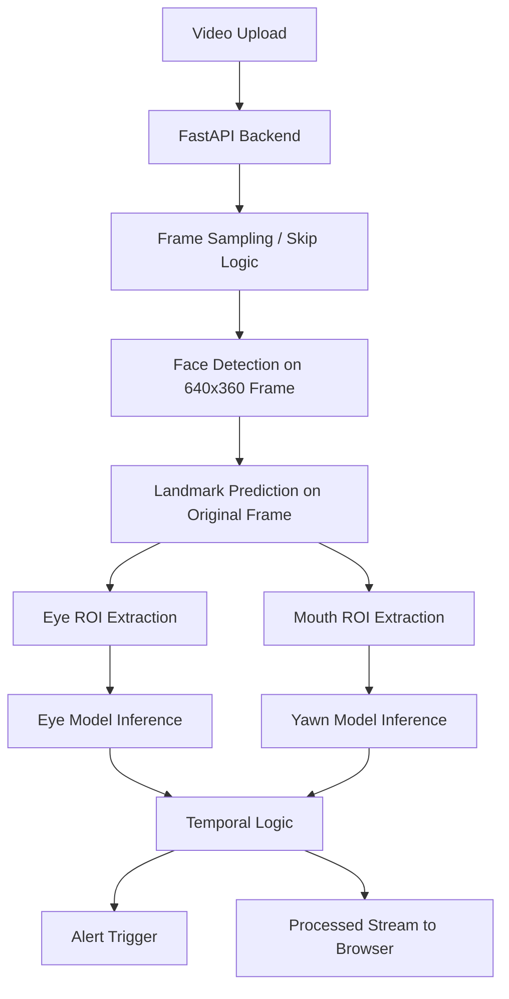

# DriveSafe-VISION-DMS-v2

**A high-performance Driver Monitoring System for real-time drowsiness detection using computer vision, deep learning, and GPU-optimized deployment.**

[GitHub Repository](https://github.com/Vatsalyakrish02/DriveSafe-VISION-DMS-v2)

> DriveSafe-VISION-DMS-v2 is a real-time Driver Monitoring System that detects driver fatigue using eye-closure and yawn analysis, delivered through a FastAPI web interface and optimized for CUDA-enabled environments.[file:1][file:4][file:5]

---

## Demo

Add the following here:
- A short GIF or MP4 of the dashboard in action.
- One screenshot of the upload page.
- One screenshot of the live monitoring page with alert state visible.
- Optional: Docker Hub badge if the image is public.

Suggested media block:

```md

```

or

```md
<video src="docs/demo.mp4" controls width="900"></video>
```

---

## Problem Statement

Driver drowsiness is a major safety risk in long-distance and night-time driving. A practical detection system must not only be accurate, but also fast enough to operate in near real time and stable enough to avoid false alerts caused by natural blinking or noisy frame-level predictions.[file:1]

Many academic projects stop at offline prediction or a basic OpenCV demo. This project focuses on a more deployment-oriented design by combining face landmark detection, deep-learning-based classification, temporal alert logic, browser-based monitoring, and containerized execution.[file:1][file:3][file:4][file:5]

---

## Solution Overview

DriveSafe-VISION-DMS-v2 uses a hybrid pipeline:

- **Face detection and landmark extraction** with dlib's frontal face detector and 68-point facial landmark predictor.[file:3]
- **Eye-state classification** using a TensorFlow/Keras model loaded in `inference.py`.[file:4]
- **Yawn classification** using a second TensorFlow/Keras model for mouth-state analysis.[file:4]
- **ROI preprocessing** that crops square eye and mouth regions, sharpens them, resizes them to model input size, and normalizes them before inference.[file:2]
- **Temporal decision logic** in the `VideoProcessor` class to reduce false positives by requiring sustained evidence instead of single-frame triggers.[file:1]
- **FastAPI-based dashboard** for video upload, processed streaming, and browser-side alert playback.[file:1]

This architecture balances classical computer vision and deep learning to deliver a usable, explainable, and deployment-ready monitoring workflow.[file:1][file:2][file:3][file:4]

---

## Key Features

- Real-time drowsiness monitoring through **eye closure** and **yawn detection**.[file:1][file:4]
- FastAPI web interface for video upload and live processed output streaming.[file:1]
- Browser-based alert mechanism with status badge and optional alarm sound.[file:1]
- Frame-skipping strategy to keep inference throughput manageable on practical hardware.[file:1]
- Adaptive GPU memory growth to avoid full VRAM pre-allocation at TensorFlow startup.[file:4]
- Dockerized deployment for reproducibility across CUDA-enabled systems.[file:5]
- ROI sharpening and normalization for more stable classification input quality.[file:2]

---

## System Architecture

You can add a simple architecture diagram here. A good version for GitHub is either Mermaid or an exported PNG.

### Pipeline

1. User uploads a driving video through the FastAPI interface.[file:1]
2. The backend initializes `VideoProcessor` and starts asynchronous processing.[file:1]
3. Frames are sampled using skip-rate logic based on source FPS and a target inference FPS of 7.0.[file:1]
4. Each processed frame is downsampled to `640x360` for faster face detection.[file:1]
5. Detected face coordinates are scaled back to the original frame for more accurate landmark prediction.[file:1]
6. Eye and mouth ROIs are extracted using landmark coordinates and preprocessed before model inference.[file:2]
7. Eye-closure and yawn predictions are accumulated over time using threshold-based logic.[file:1]
8. When sustained drowsiness is detected, the UI raises a browser alert and updates the monitoring badge.[file:1]
9. The processed video stream is served through a multipart streaming endpoint.[file:1]

### Suggested Mermaid diagram



---

## Technical Details

### Temporal alert logic

The project does not trigger alerts from a single frame. Instead, it uses temporal thresholds such as `EYE_CLOSED_SEC = 1.5` and `YAWN_SEC = 0.6`, converted into frame-based counters using the target inference FPS.[file:1]

This is an important engineering choice because it reduces false positives from normal blinking and short transient mouth movements. The implementation also includes cooldown control and partial counter decay to stabilize alert behavior over time.[file:1]

### ROI preprocessing

The helper in `processing.py` extracts square eye and mouth regions based on facial landmarks, applies padding, rescales smaller crops, sharpens the image with a custom kernel, converts BGR to RGB, resizes to `224x224`, and normalizes pixel values to `[0, 1]`.[file:2]

This preprocessing improves consistency in what the MobileNetV2-based classifiers receive, especially when the subject moves slightly or when the raw crop is small.[file:2][file:4]

### Performance optimization

The main optimization strategy in v2.0 is not just model inference, but end-to-end pipeline control. The code targets a 7 FPS inference loop, skips intermediate frames, performs face detection on a smaller frame, and only maps results back to the full-resolution frame where accuracy matters most.[file:1]

This is a strong point to highlight in interviews because it shows understanding of the latency-accuracy tradeoff rather than only model training.[file:1]

### GPU memory handling

In `inference.py`, TensorFlow GPU memory growth is enabled through `tf.config.experimental.set_memory_growth(...)`, which prevents TensorFlow from eagerly reserving the full VRAM at startup.[file:4]

This is especially useful for consumer GPUs and makes the system more stable in practical deployment environments.[file:4]

---

## Tech Stack

| Component | Technology |
|---------|------------|
| Backend API | FastAPI [file:1] |
| Computer Vision | OpenCV, dlib [file:1][file:3] |
| Deep Learning | TensorFlow, TensorFlow Hub [file:4] |
| Classification Models | Eye-state and yawn-state models loaded from `.h5` files [file:4] |
| Image Preprocessing | NumPy, OpenCV [file:2] |
| Deployment | Docker, NVIDIA CUDA base image [file:5] |
| Streaming | FastAPI `StreamingResponse` with multipart MJPEG [file:1] |

---

## Project Structure

Use a structure like this in the README:

```text
DriveSafe-VISION-DMS-v2/
├── src/
│   ├── main.py
│   ├── detection.py
│   ├── inference.py
│   └── processing.py
├── model/
│   ├── shape_predictor_68_face_landmarks.dat
│   ├── eye_model.h5
│   └── yawn_model.h5
├── docs/
│   ├── demo.gif
│   ├── architecture.png
│   └── screenshots/
├── requirements.txt
├── Dockerfile
├── alarm.wav
└── README.md
```

Adjust names to match the exact repository layout.

---

## Installation

### Local setup

```bash
git clone https://github.com/Vatsalyakrish02/DriveSafe-VISION-DMS-v2.git
cd DriveSafe-VISION-DMS-v2
python -m venv venv
source venv/bin/activate   # On Windows: venv\Scripts\activate
pip install -r requirements.txt
uvicorn src.main:app --host 0.0.0.0 --port 8000
```

Then open:

```text
http://localhost:8000
```

### Docker setup

Your current Dockerfile uses the `nvidia/cuda:11.8.0-cudnn8-devel-ubuntu22.04` base image, installs Python and system dependencies, exposes port 8000, and starts the app with Uvicorn.[file:5]

Example run commands:

```bash
docker build -t drivesafe-vision-dms-v2 .
docker run --gpus all -p 8000:8000 drivesafe-vision-dms-v2
```

If you publish to Docker Hub, add this too:

```bash
docker pull <your-dockerhub-username>/drivesafe-vision-dms-v2:latest
docker run --gpus all -p 8000:8000 <your-dockerhub-username>/drivesafe-vision-dms-v2:latest
```

---

## API and Interface

The FastAPI app currently includes:

- `/` for the landing page UI.[file:1]
- `/upload` for video upload and analysis start.[file:1]
- `/stream_result` for processed live frame streaming.[file:1]
- `/alarmstatus` for browser polling of alert state.[file:1]
- `/alarm.wav` for the audio file served to the frontend.[file:1]

This is worth documenting because it shows that the project is not only a model pipeline but also an end-user application.[file:1]

---

## Results and Performance

Replace this section with your actual measured numbers.

Suggested format:

| Metric | Value | Notes |
|--------|-------|-------|
| Target inference FPS | 7 FPS | Configured in `VideoProcessor` [file:1] |
| Eye closed threshold | 1.5 s | Temporal logic [file:1] |
| Yawn threshold | 0.6 s | Temporal logic [file:1] |
| Detection frame size | 640x360 | Faster face detection [file:1] |
| Input size to classifier | 224x224 | ROI preprocessing [file:2] |

You should later replace this with your tested metrics such as average processing FPS, alert responsiveness, and GPU used.

---

## Challenges and Improvements in v2.0

### Problems faced earlier

Possible issues that are now addressed by v2.0:

- GPU memory instability due to aggressive TensorFlow allocation.[file:4]
- High latency when processing every frame.[file:1]
- Excessive false positives from frame-wise decision making.[file:1]
- Limited usability when restricted to a local script-based workflow.[file:1]

### Improvements implemented in v2.0

- Added adaptive GPU memory growth for safer CUDA execution.[file:4]
- Introduced skip-rate logic tied to source FPS and target inference FPS.[file:1]
- Used temporal accumulation and cooldown-based alert logic.[file:1]
- Moved to a FastAPI dashboard with streaming and browser alerts.[file:1]
- Dockerized the application for easier deployment and reproducibility.[file:5]
- Improved ROI preprocessing quality using sharpening and standardized resizing.[file:2]

This section is extremely important for interview storytelling because it demonstrates iteration, debugging, and system-level thinking.[file:1][file:2][file:4][file:5]

---

## Future Improvements

A strong roadmap for v3.0 could include:

- Infrared camera support for low-light and night-driving conditions.
- Head pose estimation for distraction detection.
- TensorRT engine conversion for faster NVIDIA inference.
- Quantized or lightweight models for edge deployment.
- Multi-signal fusion with blink rate, gaze direction, and head orientation.
- Dashboard configuration for alert sensitivity and threshold tuning.
- Logging and analytics for event history and performance monitoring.

Keep this section realistic and tied to your current architecture.

---

## Resume-Ready Highlights

You can directly adapt these bullets for your CV:

- Developed a real-time Driver Monitoring System using Python, TensorFlow, dlib, and FastAPI for eye-closure and yawn-based drowsiness detection.[file:1][file:3][file:4]
- Optimized inference stability and deployment by enabling adaptive GPU memory growth and Dockerized execution.[file:4][file:5]
- Reduced processing overhead through frame-skipping, low-resolution face detection, and temporal decision logic.[file:1]
- Engineered ROI extraction and sharpening pipelines to improve robustness of eye and mouth state classification.[file:2]
- Built a browser-based monitoring workflow with live video streaming and alert triggering.[file:1]

---

## What to Add Before Finalizing the README

To make the repository fully professional, add these assets if possible:

- `docs/demo.gif` or `docs/demo.mp4`
- `docs/architecture.png`
- `docs/screenshots/home.png`
- `docs/screenshots/monitoring.png`
- `LICENSE`
- `requirements.txt`
- `CHANGELOG.md`
- `docs/limitations.md`

These are not mandatory for functionality, but they significantly improve portfolio quality.

---

## Additional Documents That Would Help

The following would help make the README stronger and more accurate:

1. **Actual performance benchmarks**: tested FPS, latency, hardware used, and any before-v2 vs after-v2 comparison.
2. **Screenshots or a short demo video**: these are the most important missing assets for recruiter visibility.
3. **Exact repository tree**: so the project structure section matches your GitHub layout perfectly.
4. **requirements.txt**: to ensure setup instructions are exact.
5. **Any training details**: dataset source, augmentation, class labels, and model training summary.
6. **Known limitations**: for example, lighting dependence, single-face assumption, or offline video-only behavior if applicable.
7. **Docker Hub link**: if you plan to publish the image publicly.

If those are available, the README can be made much sharper and more evidence-based.

---

## License

Add the actual license you want to use, such as MIT, Apache-2.0, or a custom academic/project license.

---

## Acknowledgements

You can optionally credit:

- dlib for facial landmark detection.[file:3]
- TensorFlow / TensorFlow Hub for model loading and inference.[file:4]
- OpenCV for frame processing and rendering.[file:1][file:2]
- FastAPI for the deployment interface.[file:1]

---

## Suggested final polish

Before pushing the README live, check these points:

- The first screen should show what the project does in under 10 seconds.
- The demo should appear before technical details.
- All setup steps should be copy-paste runnable.
- Every claim about performance should be backed by a measured number.
- The v2.0 improvements section should clearly distinguish this version from the earlier project.
- The repo should include enough screenshots that even a non-technical recruiter understands the outcome.

