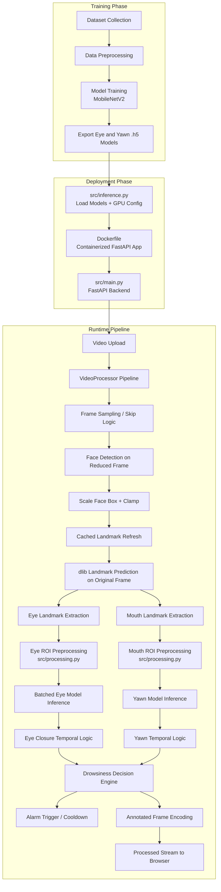

# DriveSafe-VISION-DMS-v2

The DriveSafe-VISION-DMS-v2 driver monitoring system was created, and it became a real-time system when the process of coordinate scaling was optimized and a multithreaded Python backend was added to reduce the latency of the model.
This is a real-time driver monitoring system that recognizes signs of driver drowsiness using eye closure and yawning detection and is provided via a FastAPI web interface. Real-Time Driver Monitoring System Based on Computer Vision and Deep Learning

---

## Demo

https://github.com/user-attachments/assets/fcad5b36-524b-47bd-92a3-c1d493fc355b

https://github.com/user-attachments/assets/c22d3707-e348-4572-9568-8c120d27f957

### Screenshots


---

## Problem Statement

Fatigue while driving represents one of the most significant threats for long-distance and night driving. Such a warning system should provide sufficient accuracy, speed (so that it can function in near real-time), and stability (avoiding unnecessary triggering due to normal blinking or unstable frame-by-frame predictions).
Many research projects focus on merely demonstrating offline prediction results or even an application of face landmark detector in OpenCV. This project, however, will have a deployment-oriented approach in mind when implementing face landmark detector, classification, temporal logic, web browser, and Dockerization together.

---

## Overview

The program implements the processing of driving videos using a modular pipeline that consists of face detection, ROI preprocessing, and model inference blocks. The design is based on the dlib landmark pipeline since this stack works reliably with the fixed dependencies used by the project, which includes TensorFlow 2.10.1.

The system emphasizes two indicators of drowsiness:
- Eye closure within a prolonged time window.
- Mouth opening in conjunction with yawning.
---

## Features

- Video uploading and browser-based output stream generation with FastAPI.
- Eye state classification based on a trained TensorFlow model.
- Yawn recognition based on a different TensorFlow model.
- Dlib frontal face detection with 68-point facial landmarks localization.
- ROI acquisition and preprocessing with squaring, sharpening, RGB transformation, resize, and normalization.
- Configuration of file paths via environment variables for models, uploaded files, alarms sounds, and GPU memory constraints.
- Docker containerization with a CUDA-enabled Ubuntu 22.04 base image.
---

## Project structure

```text
.
├── Dockerfile
├── file.dockerignore
├── requirements.txt
├── alarm.wav
├── model/
│   ├── TensorRT_format_model
│   ├── 20260506-1628-eye-expert-full-mobilenetv2-Adam.h5
│   ├── 20260419-1313-yawn-expert-full-mobilenetv2-Adam.h5
│   └── shape_predictor_68_face_landmarks.dat
├── docs/
├── notebooks/
│   └── driver-drowsiness-detection.ipynb
└── src/
    ├── main.py
    ├── inference.py
    ├── detection.py
    └── processing.py
```
---

### File guide

- `src/main.py` houses the FastAPI application, uploading procedure, response streamer function, alarm audio initialization, and full video processing pipeline.
- `src/inference.py` sets up TensorFlow GPU configurations and imports the eye and yawn classifiers from the model folder.
- `src/detection.py` initializes dlib frontal face detector and 68 facial landmarks predictor.
- `src/processing.py` processes eye and mouth regions of interest before inputting into the model.
- `Dockerfile` specifies GPU-enabled Docker image and runs the app using Uvicorn on port 8000.
- `file.dockerignore` filters out dataset, Jupyter notebook, temporaries, and local environment files from the Docker image.
- `requirements.txt` lists exact dependency tree used by the project.
- `driver-drowsiness-detection.ipynb` is the Jupyter notebook that was used for training and experimenting with models, and needs to be included in the project documentation page.
---

# System Architecture

## How the pipeline works

1. Video from the car dashboard camera is uploaded via the web application.
2. Driver face detection and landmark estimation are performed using dlib.
3. The eyes and mouths are cut from the image as square ROIs and processed before classification.
4. Eye state classification is done by the eye classifier and mouth movements are predicted by the yawn model.
5. An alarm is raised based on results obtained from the FastAPI application and sent back to the browser.
---

## Flow Chart


---

## Tech Stack

| Component | Technology |
|---------|------------|
| Backend API | FastAPI |
| Computer Vision | OpenCV, dlib |
| Deep Learning | TensorFlow, TensorFlow Hub |
| Classification Models | Eye-state and yawn-state models loaded from `.h5` files |
| Image Preprocessing | NumPy, OpenCV |
| Deployment | Docker, NVIDIA CUDA base image |
| Streaming | FastAPI `StreamingResponse` with multipart MJPEG |

---

## Requirements

Install all the dependencies listed in `requirements.txt`.

```bash
pip install -r requirements.txt
```

Current dependency list:

```text
fastapi
uvicorn[standard]
python-multipart
opencv-python-headless
numpy<2.0.0
dlib
tensorflow==2.10.1
tensorflow-hub
pygame
```
---

## Local setup

### 1. Clone the repository

```bash
git clone <https://github.com/Vatsalyakrish02/DriveSafe-VISION-DMS-v2/tree/main>
cd <DriveSafe-VISION-DMS-v2>
```

### 2. Install dependencies

```bash
pip install -r requirements.txt
```

### 3. Add required model files

Place these files in the `model/` directory, unless you override the path with environment variables:

- `20260506-1628-eye-expert-full-mobilenetv2-Adam.h5` — eye model.
- `20260419-1313-yawn-expert-full-mobilenetv2-Adam.h5` — yawn model.
- `shape_predictor_68_face_landmarks.dat` — dlib landmark model.

Also place `alarm.wav` in the project root, or set a custom `ALARM_PATH`.

### 4. Run the app

```bash
python src/main.py
```

Or run with Uvicorn:

```bash
uvicorn src.main:app --host 0.0.0.0 --port 8000
```

Then open the application in the browser and upload a video for analysis.
---

## Environment variables

This project is configured to be portable and deployable using environmental settings.

| Variable | Description |
|----------|-------------|
| `MODEL_DIR` | Directory that stores the trained model `.h5` files and dlib landmark file. |
| `ALARM_PATH` | Path to the audio file that plays the alarm sound. |
| `UPLOAD_DIR` | Directory to which video files are uploaded. |
| `TF_GPU_MEMORY_LIMIT_MB` | TensorFlow GPU memory limit, if any. |

---

### Example

```bash
set MODEL_DIR=C:\path\to\model
set ALARM_PATH=C:\path\to\alarm.wav
set UPLOAD_DIR=C:\path\to\uploads
set TF_GPU_MEMORY_LIMIT_MB= 4000    # It can be adjusted according to your hardware specs
```

---

## Docker

It involves the use of a Dockerfile that runs on `nvidia/cuda:11.8.0-cudnn8-devel-ubuntu22.04`. It also includes the installation of Python 3, build tools, the required system libraries for OpenCV, and runs the application using Uvicorn on port 8000. Another key feature is the setting of `SDL_AUDIODRIVER

### Build the Docker image

```bash
docker build -t drivesafe-vision-dms .
```

### Run the Docker container

```bash
docker run --rm -p 8000:8000 --gpus all drivesafe-vision-dms
```
In case GPU resources cannot be accessed, the container can still be launched without `--gpus all`. Performance may suffer due to this limitation.

---

## Training notebook

The process of training is explained in another notebook file called `driver-drowsiness-detection.ipynb`, which was used for training the model during development. Adding the above notebook to the repository, for example, to a `notebooks/` folder, and using it as an explanation on how the model was developed (the eyes and yawns classifier, respectively), will be quite useful.

A possible suggestion for documentation within the notebook section is as follows:
- dataset preparation,
- data preprocessing and augmentation,
- neural network architecture and training,
- validation metrics,
- saving `.h5` model.
---

## Deployment notes

- The current project is specifically designed using dlib instead of MediaPipe since the pinned stack dependencies work perfectly for this method.
- The modularity of `main.py`, `inference.py`, `detection.py`, and `processing.py` ensures that optimization becomes easy once there is a need to optimize any portion of the pipeline.
- The current application works on the principle of uploading videos; however, in the future, this pipeline can also be made adaptable to the dashcam or webcam approach.
---

## Limitations

- Performance is affected by the hardware, video resolution, and speed of the dlib landmark detector.
- Trained models and dlib landmarks are not installed as part of the Python requirements and need to be provided externally.
- Detection accuracy will be affected in conditions of low light, face obstruction, wearing glasses, motion blur, or sudden head movement.
---

## Future improvements

- Live streaming support for dash cam footage.
- Benchmarking of MediaPipe on another machine to compare its performance with dlib.
- Incorporation of other driving cues like EAR, MAR, or head pose.
- Adding information regarding training accuracy and development of models to the repository documentation.
---

## Disclaimer

This work was developed with the aim of using it as an experimental and training tool within driver monitoring applications. Its implementation within any kind of road safety application must be validated exhaustively under different lighting, camera, car and driving conditions.
